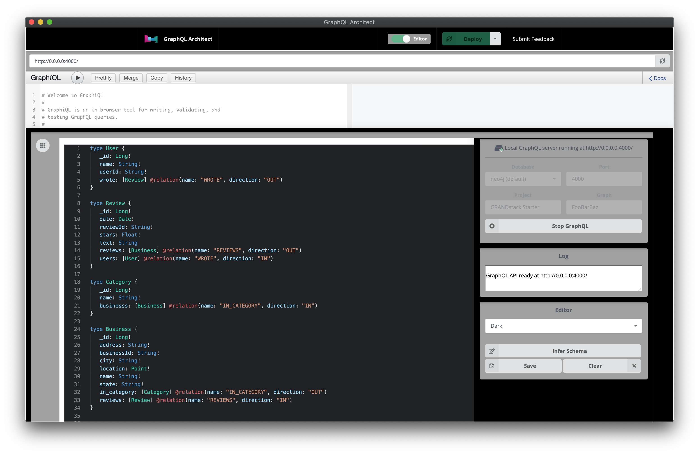
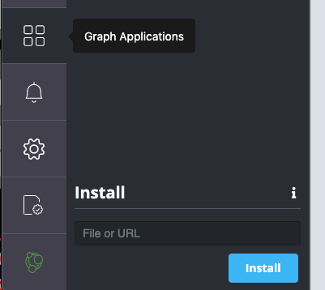
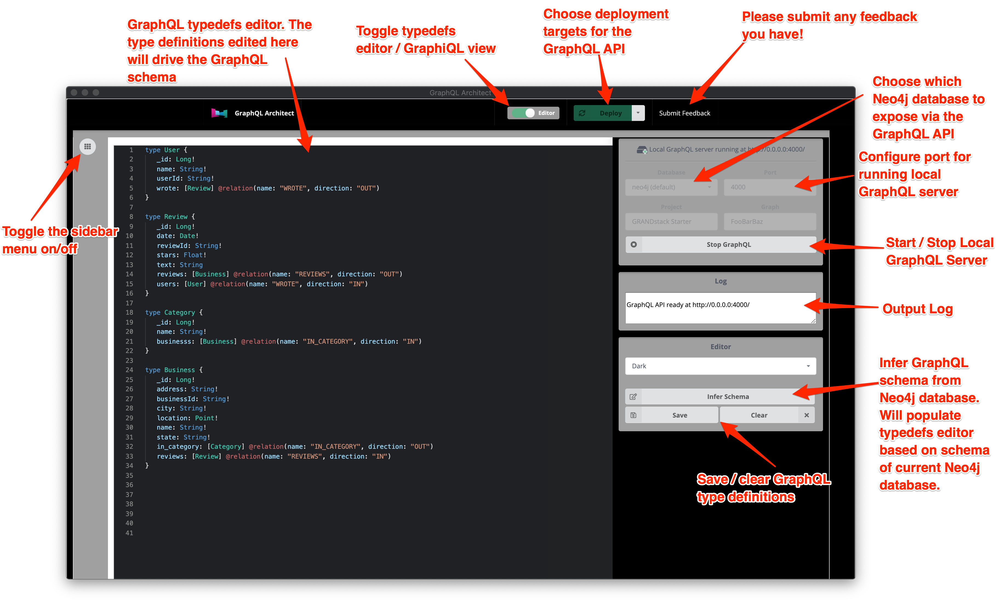
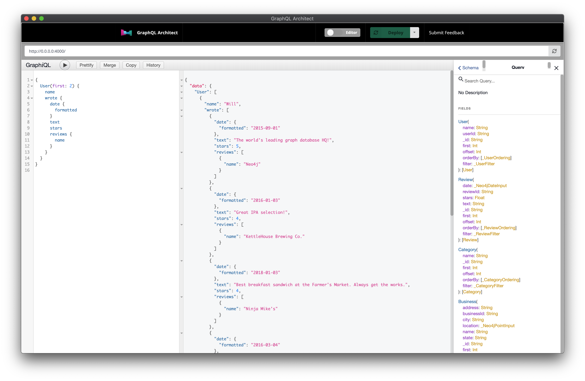

> Please [open a Github issue](https://github.com/grand-stack/graphql-architect/issues) to submit any feedback you have.

# GraphQL Architect

A Neo4j Graph App for building and deploying GraphQL APIs backed by Neo4j.



## Install

To install in Neo4j Desktop click [this deeplink.](neo4j-desktop://graphapps/install?url=https://registry.npmjs.org/@grandstack/graphql-architect)

Or paste the following URL into the "Graph Application" Install form field in Neo4j Desktop:

```
https://registry.npmjs.org/@grandstack/graphql-architect
```



If you don't have Neo4j Desktop installed you can download it from [the Neo4j download center.](https://neo4j.com/download)

## Features




**Query with GraphiQL**

